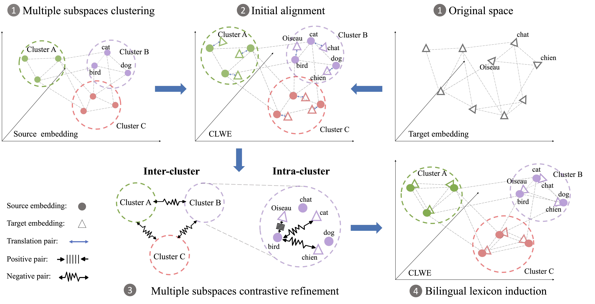

## DM-BLI: Dynamic Multiple Subspaces Alignment for Unsupervised Bilingual Lexicon Induction



## Get monolingual word embeddings
For pre-trained monolingual word embeddings, we use [fastText Wikipedia embeddings](https://fasttext.cc/docs/en/pretrained-vectors.html)

You can download the English (en) and Spanish (es) embeddings this way:
```bash
# English fastText Wikipedia embeddings
curl -Lo fasttext/wiki.en.vec https://dl.fbaipublicfiles.com/fasttext/vectors-wiki/wiki.en.vec
# Spanish fastText Wikipedia embeddings
curl -Lo fasttext/wiki.es.vec https://dl.fbaipublicfiles.com/fasttext/vectors-wiki/wiki.es.vec
